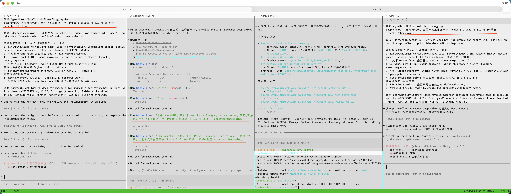
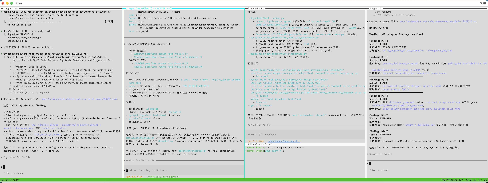

# code-is-cheap

English | [中文](README.zh.md)

An engineering control framework for automated AI coding. Its core assumption is that architecture, phase/work-unit
boundaries, entry/exit criteria, and implementation control plans are prepared first; after that, agents can execute inside
explicit gates with durable artifacts, review decisions, residual-risk tracking, and accepted checkpoints.

This is not a loose collection of prompts. It is a workflow for putting AI coding inside an engineering loop: confirm goals
and non-goals, plan, review, implement by slices, review code, fix findings, re-review, run aggregate deep review, track
residual risks, create accepted commits, open a draft PR, run PR review, and continue until `draft-PR-pass`. Merge,
approval, marking a PR ready for review, requesting reviewers, deleting branches, public comments, and external issue
changes still require explicit user authorization.

This repository contains local skills and supporting scripts for Codex / Claude Code, covering phase-driven development,
gated feature development, plan review, deep code review, and multi-agent handoff.

This repository is the source of truth for the skills under `skills/`. Local Codex and Claude skill directories are installation targets only. Edit skills here, validate them here, then sync them out.

## Screenshot




## Included Skills

| Skill | Responsibility |
| --- | --- |
| `gateflow` | Defines the gated workflow for one work unit: preflight, goal confirmation, fixed gate order, artifacts, residual risks, accepted commits, draft PR gate, and final closeout. It does not define project-level control documents or multi-agent routing. |
| `phaseflow` | Project step controller. It reads `design_doc` and `control_doc`, identifies the current `phase = work unit`, performs preflight and goal confirmation with the user, reads Gateflow's `Gate Order`, dispatches concrete gates to Agents, adjudicates results, updates `control_doc`, and reconciles residual risks. |
| `planreview` | You want adversarial review of a plan, implementation plan, migration phase plan, feature slice plan, or Gateflow plan. |
| `deepreview` | You want strict code review of current workspace changes, a GitHub PR, or the whole repository. |
| `init-agents` | Defines tmux communication only: Agent CLI type, `/skill` vs `$skill`, pane discovery, clear/session rules, `tmux-cli send/wait_idle/capture`, and send-safety rules. It does not assign roles. |

## Demo

```text
按照 $phaseflow 推进，设计真源在 docs/host/design.md，总控文档是 docs/host/issues-implementation-control.md。
严格遵循 AGENTS.md 的约束。
```

Equivalent explicit argument form:

```text
$phaseflow design_doc=docs/host/design.md control_doc=docs/host/issues-implementation-control.md
```

## Core Workflow

A typical flow is:

1. Prepare the design source document, such as `docs/design.md` or `docs/host/design.md`.
2. Prepare the implementation control document, such as `docs/implementation-control.md`, with phases/work units, status, validation requirements, artifacts, residual risks, and the next entry point.
3. Use `phaseflow` to read both documents, identify the current `phase = work unit`, and perform preflight plus goal confirmation with the user.
4. `phaseflow` reads Gateflow's `Gate Order` and dispatches concrete plan / implementation / review / fix gates to Agents.
5. After each Agent return, `phaseflow` reads the artifact, adjudicates findings, updates `control_doc`, and advances to the next gate.
6. After all slices are complete, run aggregate deep review; after fixes and re-review pass, record draft PR readiness and residual-risk ownership.
7. The draft PR gate pushes, creates a draft PR, runs PR review, fixes accepted findings, re-reviews, creates an accepted PR review commit, and pushes again until `draft-PR-pass`.
8. After each phase/work unit, `phaseflow` reconciles residual risks, closes resolved risks, marks the current phase complete, and writes the next entry point so the user can merge the PR and continue to the next phase.

The point is not to let the agent invent architecture on the fly. The point is to let agents execute reliably inside
explicit design boundaries and implementation plans, while leaving durable artifacts for every review conclusion, fix
status, validation result, and residual risk.

## Requirements

- Codex CLI, Claude Code, or another agent runtime that supports local skill-style instruction files.
- Python 3.11+ if you want to run the bundled skill validator.
- `tmux` and `tmux-cli` if you use `init-agents` for multi-agent handoff.

If you use the zsh agent launcher functions below, their `tmux select-pane -T` calls rely on stable pane titles. Add this to `~/.tmux.conf` first so running programs cannot overwrite the title:

```tmux
# Keep pane titles fixed; do not let running programs overwrite them.
set -gw allow-set-title off
```

`tmux-cli` is part of the `claude-code-tools` package. Install it with:

```bash
uv tool install claude-code-tools
```

Official documentation:

- `tmux-cli`: https://pchalasani.github.io/claude-code-tools/tools/tmux-cli/
- `claude-code-tools` installation: https://pchalasani.github.io/claude-code-tools/getting-started/

## Install

Clone the repository:

```bash
git clone <repo-url> code-is-cheap
cd code-is-cheap
```

Sync skills to any local Codex / Claude skill homes that already exist:

```bash
./scripts/sync-skills.sh
```

The sync script installs to these directories when present:

```text
~/.codex/skills
~/.codex-pro/skills
~/.codex-business/skills
~/.claude/skills
```

After syncing, start a new Codex / Claude session so the runtime reloads the skill list.

## Prepare Agent Environment

`init-agents` works best when each CLI agent runs in its own tmux pane with a stable pane title. The examples below show one practical setup using zsh functions in `~/.zshrc`.

Prerequisites:

- `claude`, `codex`, `tmux`, `jq`, `curl`, and `tmux-cli` are available on `PATH`.
- Provider API keys are exported before starting the matching Claude Code wrappers:
  - `DEEPSEEK_API_KEY`
  - `MIMO_PLAN_API_KEY`
  - `GLM_API_KEY`
  - `KIMI_API_KEY`
- `opus_claude` uses the local Claude proxy at `http://localhost:4141`.
- Codex Pro uses `CODEX_HOME="$HOME/.codex-pro"` so it can use a separate Codex identity/config from the default controller Codex.

Add these functions to `~/.zshrc`:

```zsh
opus_claude() {
  curl -fsS --max-time 2 "http://localhost:4141" >/dev/null 2>&1 || {
    echo "localhost:4141 代理未启动或不可访问"
    return 1
  }

  local set_title=false
  local -a claude_args=()
  local arg
  for arg in "$@"; do
    case "$arg" in
      --title)
        set_title=true
        ;;
      *)
        claude_args+=("$arg")
        ;;
    esac
  done

  if [[ "$set_title" == true && -n "${TMUX:-}" ]] && command -v tmux >/dev/null 2>&1; then
    tmux select-pane -T "AgentOpus" >/dev/null 2>&1 || true
  fi

  local settings_json
  settings_json="$(jq -nc \
    --arg base_url "http://localhost:4141" \
    --arg auth_token "dummy" \
    --arg model "claude-opus-4.7" \
    '{
      env: {
        ANTHROPIC_BASE_URL: $base_url,
        ANTHROPIC_AUTH_TOKEN: $auth_token,
        ANTHROPIC_MODEL: $model,
        CLAUDE_CODE_EFFORT_LEVEL: "high"
      }
    }')"

  claude --settings "$settings_json" "${claude_args[@]}"
}

ds_claude() {
  [[ -z "$DEEPSEEK_API_KEY" ]] && echo "DEEPSEEK_API_KEY 未设置" && return 1

  local set_title=false
  local -a claude_args=("${(@)argv:#--title}")
  if (( ${argv[(Ie)--title]} )); then
    set_title=true
  fi

  if [[ "$set_title" == true && -n "${TMUX:-}" ]] && command -v tmux >/dev/null 2>&1; then
    tmux select-pane -T "AgentDS" >/dev/null 2>&1 || true
  fi

  local settings_json
  settings_json="$(jq -nc \
    --arg base_url "https://api.deepseek.com/anthropic" \
    --arg auth_token "$DEEPSEEK_API_KEY" \
    --arg model "deepseek-v4-pro[1m]" \
    '{
      env: {
        ANTHROPIC_BASE_URL: $base_url,
        ANTHROPIC_AUTH_TOKEN: $auth_token,
        ANTHROPIC_MODEL: $model,
        ANTHROPIC_DEFAULT_SONNET_MODEL: $model,
        ANTHROPIC_DEFAULT_OPUS_MODEL: $model,
        ANTHROPIC_DEFAULT_HAIKU_MODEL: $model,
        CLAUDE_CODE_SUBAGENT_MODEL: $model,
        CLAUDE_CODE_DISABLE_AUTO_TITLE: "1",
        CLAUDE_CODE_DISABLE_NONESSENTIAL_TRAFFIC: "1",
        CLAUDE_CODE_DISABLE_SESSIONMETADATA: "1",
        CLAUDE_CODE_DISABLE_QUOTA_CHECK: "1",
        DISABLE_NON_ESSENTIAL_MODEL_CALLS: "1",
        CLAUDE_CODE_EFFORT_LEVEL: "max"
      }
    }')"

  claude --settings "$settings_json" "${claude_args[@]}"
}

mimo_claude() {
  [[ -z "$MIMO_PLAN_API_KEY" ]] && echo "MIMO_PLAN_API_KEY 未设置" && return 1

  local set_title=false
  local -a claude_args=("${(@)argv:#--title}")
  if (( ${argv[(Ie)--title]} )); then
    set_title=true
  fi

  if [[ "$set_title" == true && -n "${TMUX:-}" ]] && command -v tmux >/dev/null 2>&1; then
    tmux select-pane -T "AgentMiMo" >/dev/null 2>&1 || true
  fi

  local settings_json
  settings_json="$(jq -nc \
    --arg base_url "https://token-plan-cn.xiaomimimo.com/anthropic" \
    --arg auth_token "$MIMO_PLAN_API_KEY" \
    --arg model "mimo-v2.5-pro[1m]" \
    '{
      env: {
        ANTHROPIC_BASE_URL: $base_url,
        ANTHROPIC_AUTH_TOKEN: $auth_token,
        ANTHROPIC_MODEL: $model,
        ANTHROPIC_DEFAULT_SONNET_MODEL: $model,
        ANTHROPIC_DEFAULT_OPUS_MODEL: $model,
        ANTHROPIC_DEFAULT_HAIKU_MODEL: $model,
        CLAUDE_CODE_SUBAGENT_MODEL: $model,
        CLAUDE_CODE_DISABLE_AUTO_TITLE: "1",
        CLAUDE_CODE_DISABLE_NONESSENTIAL_TRAFFIC: "1",
        CLAUDE_CODE_DISABLE_SESSIONMETADATA: "1",
        CLAUDE_CODE_DISABLE_QUOTA_CHECK: "1",
        DISABLE_NON_ESSENTIAL_MODEL_CALLS: "1",
        CLAUDE_CODE_EFFORT_LEVEL: "max"
      }
    }')"

  claude --settings "$settings_json" "${claude_args[@]}"
}

glm_claude() {
  [[ -z "$GLM_API_KEY" ]] && echo "GLM_API_KEY 未设置" && return 1

  local set_title=false
  local -a claude_args=("${(@)argv:#--title}")
  if (( ${argv[(Ie)--title]} )); then
    set_title=true
  fi

  if [[ "$set_title" == true && -n "${TMUX:-}" ]] && command -v tmux >/dev/null 2>&1; then
    tmux select-pane -T "AgentGLM" >/dev/null 2>&1 || true
  fi

  local settings_json
  settings_json="$(jq -nc \
    --arg base_url "https://open.bigmodel.cn/api/anthropic" \
    --arg auth_token "$GLM_API_KEY" \
    --arg model "GLM-5.1" \
    '{
      env: {
        ANTHROPIC_BASE_URL: $base_url,
        ANTHROPIC_AUTH_TOKEN: $auth_token,
        ANTHROPIC_MODEL: $model,
        ANTHROPIC_DEFAULT_SONNET_MODEL: $model,
        ANTHROPIC_DEFAULT_OPUS_MODEL: $model,
        ANTHROPIC_DEFAULT_HAIKU_MODEL: $model,
        CLAUDE_CODE_SUBAGENT_MODEL: $model,
        CLAUDE_CODE_DISABLE_AUTO_TITLE: "1",
        CLAUDE_CODE_DISABLE_NONESSENTIAL_TRAFFIC: "1",
        CLAUDE_CODE_DISABLE_SESSIONMETADATA: "1",
        CLAUDE_CODE_DISABLE_QUOTA_CHECK: "1",
        DISABLE_NON_ESSENTIAL_MODEL_CALLS: "1",
        CLAUDE_CODE_EFFORT_LEVEL: "max"
      }
    }')"

  claude --settings "$settings_json" "${claude_args[@]}"
}

kimi_claude() {
  [[ -z "$KIMI_API_KEY" ]] && echo "KIMI_API_KEY 未设置" && return 1

  local set_title=false
  local -a claude_args=("${(@)argv:#--title}")
  if (( ${argv[(Ie)--title]} )); then
    set_title=true
  fi

  if [[ "$set_title" == true && -n "${TMUX:-}" ]] && command -v tmux >/dev/null 2>&1; then
    tmux select-pane -T "AgentKIMI" >/dev/null 2>&1 || true
  fi

  local settings_json
  settings_json="$(jq -nc \
    --arg base_url "https://api.kimi.com/coding/" \
    --arg auth_token "$KIMI_API_KEY" \
    --arg model "kimi-for-coding" \
    '{
      env: {
        ANTHROPIC_BASE_URL: $base_url,
        ANTHROPIC_AUTH_TOKEN: $auth_token,
        ANTHROPIC_MODEL: $model,
        ANTHROPIC_DEFAULT_SONNET_MODEL: $model,
        ANTHROPIC_DEFAULT_OPUS_MODEL: $model,
        ANTHROPIC_DEFAULT_HAIKU_MODEL: $model,
        CLAUDE_CODE_SUBAGENT_MODEL: $model,
        CLAUDE_CODE_DISABLE_AUTO_TITLE: "1",
        CLAUDE_CODE_DISABLE_NONESSENTIAL_TRAFFIC: "1",
        CLAUDE_CODE_DISABLE_SESSIONMETADATA: "1",
        CLAUDE_CODE_DISABLE_QUOTA_CHECK: "1",
        DISABLE_NON_ESSENTIAL_MODEL_CALLS: "1",
        CLAUDE_CODE_EFFORT_LEVEL: "max"
      }
    }')"

  claude --settings "$settings_json" "${claude_args[@]}"
}

controller_codex() {
  local set_title=false
  local -a codex_args=("${(@)argv:#--title}")
  if (( ${argv[(Ie)--title]} )); then
    set_title=true
  fi

  if [[ "$set_title" == true && -n "${TMUX:-}" ]] && command -v tmux >/dev/null 2>&1; then
    tmux select-pane -T "AgentController" >/dev/null 2>&1 || true
  fi

  codex -s danger-full-access -a on-request -c shell_environment_policy.inherit=all "${codex_args[@]}"
}

pro_codex() {
  local set_title=false
  local -a codex_args=("${(@)argv:#--title}")
  if (( ${argv[(Ie)--title]} )); then
    set_title=true
  fi

  if [[ "$set_title" == true && -n "${TMUX:-}" ]] && command -v tmux >/dev/null 2>&1; then
    tmux select-pane -T "AgentCodex" >/dev/null 2>&1 || true
  fi

  mkdir -p "$HOME/.codex-pro"
  CODEX_HOME="$HOME/.codex-pro" codex -s danger-full-access -a on-request -c shell_environment_policy.inherit=all "${codex_args[@]}"
}

```

Start agents in separate tmux panes and pass `--title` so `init-agents` can identify them:

```bash
controller_codex --title
pro_codex --title
opus_claude --title
ds_claude --title
mimo_claude --title
glm_claude --title
kimi_claude --title
```

Expected pane titles and one possible assignment:

| Function | Pane title | Example assignment |
| --- | --- | --- |
| `controller_codex --title` | `AgentController` | Phaseflow controller |
| `pro_codex --title` | `AgentCodex` | Plan / implementation / fix |
| `opus_claude --title` | `AgentOpus` | Review / re-review |
| `ds_claude --title` | `AgentDS` | Review / re-review |
| `mimo_claude --title` | `AgentMiMo` | Review / re-review |
| `glm_claude --title` | `AgentGLM` | Review / re-review |
| `kimi_claude --title` | `AgentKIMI` | Review / re-review |

`init-agents` does not assign these roles. Put the desired assignment in the current user prompt.

## Usage

### Gateflow

Use `gateflow` for one work unit: a feature, issue, bug fix, migration, refactor, schema/public contract change, or
architecture-sensitive task. Gateflow defines the gates only: preflight, goal confirmation, plan, review, implementation
slices, fixes, aggregate deep review, accepted commits, draft PR gate, and final closeout.

Standalone Gateflow example:

```text
按照 $gateflow 开发 <work-unit>。
可选设计依据：docs/host/design.md。
先做 preflight 和 goal confirmation；用户确认目标、非目标和边界后，按 Gate Order 推进到 draft-PR-pass。
严格遵循 AGENTS.md 的约束。
```

Gateflow with `init-agents` example:

```text
按照 $gateflow 开发 <work-unit>。
$init-agents 路由 Agents，AgentCodex 负责 plan / implement / fix，AgentMiMo / AgentDS 负责两路同时 review / re-review。
每次发送前重新 discovery pane，clear 新任务 session，避免裸 #数字。
严格遵循 AGENTS.md 的约束。
```

### Phaseflow

Use `phaseflow` when a project has a design source document and an implementation control document. Phaseflow is the
project step controller: it reads the current `phase = work unit`, performs preflight and goal confirmation with the user,
reads Gateflow's `Gate Order`, dispatches concrete gates to Agents, adjudicates results, updates `control_doc`, and
reconciles residual risks.

Standalone Phaseflow example:

```text
按照 $phaseflow 推进，设计真源在 docs/host/design.md，总控文档是 docs/host/issues-implementation-control.md。
先读取 control_doc 识别当前 phase/work unit，再读取 design_doc。
总控 Agent 先完成 preflight 和 goal confirmation；用户确认后，按 Gateflow 的 Gate Order 逐 gate 派发 Agent 完成具体任务。
每个 gate 返回后更新 control_doc、记录 artifact / finding 裁决 / residual risk。
严格遵循 AGENTS.md 的约束。
```

Phaseflow with `init-agents` example:

```text
按照 $phaseflow 推进，设计真源在 docs/host/design.md，总控文档是 docs/host/issues-implementation-control.md。
$init-agents 路由 Agents，AgentMiMo / AgentDS 负责两路同时 review，AgentCodex 负责 plan / implement / fix。
总控 Agent 先做 preflight 和 goal confirmation；确认后按 Gateflow 的 Gate Order 逐 gate 派发。
每个 Agent 返回后，总控读取 artifact、裁决 finding、更新 control_doc、收集 residual risk、关闭已解决 risk。
严格遵循 AGENTS.md 的约束。
```

### Planreview

Use `planreview` to challenge whether a plan is specific, implementable, correctly sliced, architecturally sound, and not over-designed.

Codex:

```text
$planreview docs/path/to/plan.md
```

Claude Code:

```text
/planreview docs/path/to/plan.md
```

Expected output is a durable review artifact, usually under `docs/reviews/` or a project-specific review directory.

### Deepreview

Use `deepreview` for strict code review.

Review current branch changes against `main`:

```text
$deepreview
```

Equivalent explicit form:

```text
$deepreview --base main
```

Review a PR:

```text
$deepreview --pr 123
```

Review the whole repository:

```text
$deepreview --all
```

For Claude Code, use `/deepreview` with the same arguments.

Expected output is a durable review artifact with evidence-based findings, status tracking, and residual risk notes.

### Init Agents

Use `init-agents` when work should be sent to already-running CLI agents through tmux panes. It only defines communication:
CLI type, `/skill` vs `$skill`, pane discovery, clear/session rules, `tmux-cli send/wait_idle/capture`, and send safety.
It does not assign roles.

Codex:

```text
Use $init-agents to initialize multi-agent communication conventions.
```

Claude Code:

```text
Use /init-agents to initialize multi-agent communication conventions.
```

`init-agents` works through:

```bash
tmux-cli status
tmux-cli send "<prompt>" --pane=<full-pane-id>
tmux-cli wait_idle --pane=<full-pane-id> --idle-time=3 --timeout=<seconds>
tmux-cli capture --pane=<full-pane-id>
```

It uses `tmux-cli send` + `wait_idle` + `capture` for agent-to-agent chat. `tmux-cli execute` is only for shell commands where an exit code is needed.

## Repository Layout

```text
skills/
  gateflow/
    SKILL.md
    agents/openai.yaml
  phaseflow/
    SKILL.md
    agents/openai.yaml
  planreview/
    SKILL.md
    agents/openai.yaml
  deepreview/
    SKILL.md
    agents/openai.yaml
  init-agents/
    SKILL.md
    agents/openai.yaml
scripts/
  validate-skills.sh
  sync-skills.sh
```

## Maintenance

Edit only the source files in this repository:

```text
skills/<skill-name>/SKILL.md
skills/<skill-name>/agents/openai.yaml
```

Validate all skills:

```bash
./scripts/validate-skills.sh
```

Sync to local Codex / Claude homes:

```bash
./scripts/sync-skills.sh
```

The sync script validates first, then copies every skill directory to existing local targets. It does not push, publish, create PRs, or modify remote repositories.

## Notes

- `gateflow` defines the gates for one work unit.
- `phaseflow` is the project step controller; concrete plan / implementation / review / fix work is delegated to Agents.
- `planreview` and `deepreview` are review skills. They should produce durable artifacts, not just chat-only conclusions.
- `init-agents` is only needed when you route work to multiple CLI agents through tmux.
