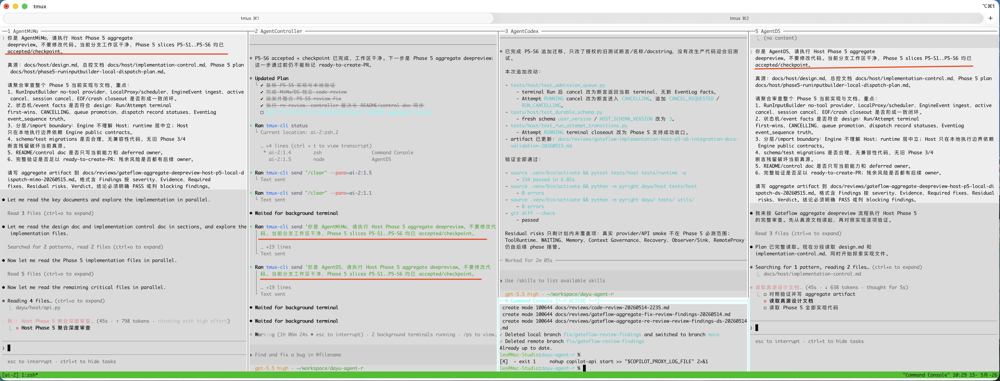
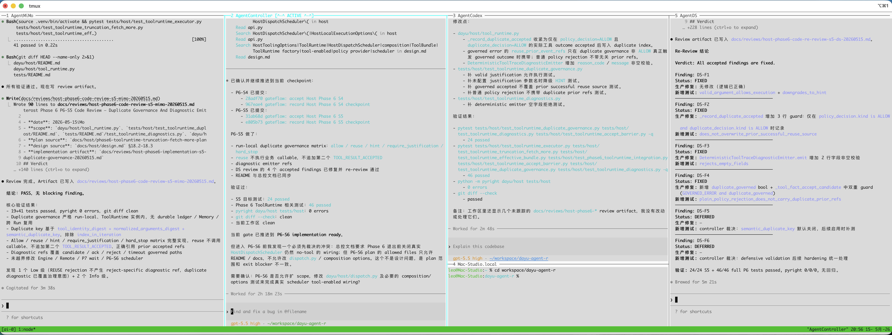

# code-is-cheap

English | [中文](README.zh.md)

An engineering control framework for automated AI coding. Its core assumption is that architecture, phase/work-unit
boundaries, entry/exit criteria, and implementation control plans are prepared first; after that, agents can execute inside
explicit gates with durable artifacts, review decisions, residual-risk tracking, and accepted checkpoints.

This is not a loose collection of prompts. It is a workflow for putting AI coding inside an engineering loop: confirm goals
and non-goals, plan, review, implement by slices, review code, fix findings, re-review, run aggregate deep review, track
residual risks, create accepted commits, open a draft PR, run PR review, and continue through final closeout. Merge,
approval, marking a PR ready for review, requesting reviewers, deleting branches, public comments, and external issue
changes still require explicit user authorization.

This repository contains local skills and supporting scripts for Codex / Claude Code, covering phase-driven development,
gated feature development, plan review, deep code review, and multi-agent handoff.

This repository is the source of truth for the skills under `skills/`, the agent launcher under
`scripts/agent-tools.zsh`, and the child-agent runners under `scripts/*-agent-run`. Local runtime files are installation
targets only. Edit and validate sources here, then sync them out.

## Screenshot




## Included Skills

| Skill | Responsibility |
| --- | --- |
| `gateflow` | Defines the gated workflow for one work unit: preflight, goal confirmation, fixed gate order, artifacts, residual risks, accepted commits, draft PR gate, and final closeout. It does not define project-level control documents or multi-agent routing. |
| `phaseflow` | Project step controller. It reads `design_doc` and `control_doc`, identifies the current `phase = work unit`, performs preflight and goal confirmation with the user, reads Gateflow's `Gate Order`, dispatches concrete gates to Agents, adjudicates results, updates `control_doc`, and reconciles residual risks. |
| `planreview` | You want adversarial review of a plan, implementation plan, migration phase plan, feature slice plan, or Gateflow plan. |
| `deepreview` | You want strict code review of current workspace changes, a GitHub PR, or the whole repository. |
| `tmux-agents` | Defines tmux communication only: Agent CLI type, `/skill` vs `$skill`, pane discovery, clear/session rules, `tmux-cli send/wait_idle/capture`, and send-safety rules. It does not assign roles. |
| `sub-agents` | Launches external Claude Code or Codex child agents through runner subprocesses, validates structured results, and supports isolated parallel dispatch without assigning roles. |

## Demo

```text
按照 $phaseflow 推进，设计真源在 docs/host/design.md，总控文档是 docs/host/issues-implementation-control.md。
严格遵循 AGENTS.md 的约束。
```

Equivalent explicit argument form:

```text
$phaseflow design_doc=docs/host/design.md control_doc=docs/host/issues-implementation-control.md
```

## Core Workflow

A typical flow is:

1. Prepare the design source document, such as `docs/design.md` or `docs/host/design.md`.
2. Prepare the implementation control document, such as `docs/implementation-control.md`, with phases/work units, status, validation requirements, artifacts, residual risks, and the next entry point.
3. Use `phaseflow` to read both documents, identify the current `phase = work unit`, and perform preflight plus goal confirmation with the user.
4. `phaseflow` reads Gateflow's `Gate Order` and dispatches concrete plan / implementation / review / fix gates to Agents.
5. After each Agent return, `phaseflow` reads the artifact, adjudicates findings, updates `control_doc`, and advances to the next gate.
6. After all slices are complete, run aggregate deep review; after fixes and re-review pass, record draft PR readiness and residual-risk ownership.
7. The draft PR gate pushes, creates a draft PR, runs PR review, fixes accepted findings, re-reviews, creates an accepted PR review commit, and pushes again until `draft-PR-pass`.
8. Final closeout then records what changed, what was verified, docs updates, finding status, remaining risks and owners, the draft PR URL, and the next entry point.
9. For issue work units, the draft PR body should link the issue; final closeout should confirm the issue closeout comment and the merge-time closing expectation.
10. After final closeout passes, the user manually merges the PR, pulls the latest target base branch, clears the agent session if desired, and resumes `phaseflow` from the `control_doc` next entry point.

The point is not to let the agent invent architecture on the fly. The point is to let agents execute reliably inside
explicit design boundaries and implementation plans, while leaving durable artifacts for every review conclusion, fix
status, validation result, and residual risk.

## Requirements

- Codex CLI, Claude Code, or another agent runtime that supports local skill-style instruction files.
- Python 3.11+ (invoked as `python3`) and the `pyyaml` package if you want to run the bundled skill validator.
- `tmux` and `tmux-cli` if you use `tmux-agents` for multi-agent handoff.

If you use the zsh agent launcher functions below, their `tmux select-pane -T` calls rely on stable pane titles. Add this to `~/.tmux.conf` first so running programs cannot overwrite the title:

```tmux
# Keep pane titles fixed; do not let running programs overwrite them.
set -gw allow-set-title off
```

`tmux-cli` is part of the `claude-code-tools` package. Install it with:

```bash
uv tool install claude-code-tools
```

Official documentation:

- `tmux-cli`: https://pchalasani.github.io/claude-code-tools/tools/tmux-cli/
- `claude-code-tools` installation: https://pchalasani.github.io/claude-code-tools/getting-started/

## Install

Clone the repository:

```bash
git clone <repo-url> code-is-cheap
cd code-is-cheap
```

Install the Python dependency required by the skill validator:

```bash
python3 -m pip install pyyaml
```

> **Note:** On macOS with Homebrew Python you may need `--break-system-packages`, or use a virtual environment.

Sync skills to any local Codex / Claude skill homes that already exist:

```bash
./scripts/sync-skills.sh
```

The sync script installs to these directories when present:

```text
~/.codex/skills
~/.claude/skills
```

After syncing, start a new Codex / Claude session so the runtime reloads the skill list.

## Prepare Agent Environment

The versioned sources are `scripts/agent-tools.zsh`, `scripts/claude-agent-run`, and `scripts/codex-agent-run`. Their
installed copies live under `~/.config/zsh` and `~/.local/bin`; edit the repository sources and sync them rather than
editing installed copies.

Prerequisites:

- `zsh`, `claude`, `codex`, `jq`, and `curl` are available on `PATH`.
- `~/.local/bin` is on `PATH` so the child-agent runners can be invoked by name.
- Provider credentials are exported before launching the matching agent:
  `DEEPSEEK_API_KEY`, `MIMO_PLAN_API_KEY`, `QWEN_API_KEY`, `KIMI_API_KEY`, and `GLM_API_KEY`.
- Each Codex profile has a readable `~/.codex-agent/<agent-id>/config.toml`.
- The `local` launchers require a healthy OpenAI-compatible service at `http://127.0.0.1:8080`.

Keep credentials in the environment or in the untracked local file
`~/.config/zsh/agent-tools.local.zsh`. The installed launcher loads that file automatically when it exists. Never add
credentials to `scripts/agent-tools.zsh`.

Install or update the launcher and child-agent runners:

```bash
./scripts/sync-agent-tools.sh
```

Load it from `~/.zshrc`:

```zsh
[[ -r "$HOME/.config/zsh/agent-tools.zsh" ]] && source "$HOME/.config/zsh/agent-tools.zsh"
```

Reload the current shell after syncing:

```bash
source ~/.zshrc
```

Available launchers:

| Runtime | Agent IDs | Commands |
| --- | --- | --- |
| Claude Code | `ds`, `mimo`, `qwen`, `kimi`, `glm`, `local` | `<agent-id>_claude [args...]` |
| Codex CLI | `ds`, `mimo`, `qwen`, `kimi`, `glm`, `local`, `gpt`, `business` | `<agent-id>_codex [args...]` |
| Codex app | Same as Codex CLI | `<agent-id>_codex_app [workspace]` |

Pass `--title` to a CLI launcher to set a stable tmux pane title such as `ClaudeAgent-DS` or `CodexAgent-GPT`.
The app launchers open a new Codex app instance with the selected profile and optional workspace.

```bash
mimo_claude --title
gpt_codex --title
business_codex_app /path/to/workspace
```

`tmux-agents` discovers these pane titles but does not assign roles. Put the desired assignment in the current user
prompt.

For non-interactive child-agent calls, use the installed runner commands:

```bash
claude-agent-run --provider mimo --cwd /path/to/workspace --prompt-file task.md
codex-agent-run --provider gpt --cwd /path/to/workspace --prompt-file task.md
```

The runners accept prompts through `--prompt`, `--prompt-file`, positional text, or stdin, and support output files,
ephemeral or persistent sessions, and provider-specific passthrough arguments. Run either command with `--help` for the
complete interface. Orchestrators must always pass `--cwd` explicitly so child agents do not accidentally inherit the
controller's workspace.

## Usage

### Gateflow

Use `gateflow` for one work unit: a feature, issue, bug fix, migration, refactor, schema/public contract change, or
architecture-sensitive task. Gateflow defines the gates only: preflight, goal confirmation, plan, review, implementation
slices, fixes, aggregate deep review, accepted commits, draft PR gate, and final closeout.

Standalone Gateflow example:

```text
按照 $gateflow 开发 <work-unit>。
可选设计依据：docs/host/design.md。
先做 preflight 和 goal confirmation；用户确认目标、非目标和边界后，按 Gate Order 推进到 final closeout。
严格遵循 AGENTS.md 的约束。
```

Gateflow with `tmux-agents` example:

```text
按照 $gateflow 开发 <work-unit>。
$tmux-agents 路由 Agents，CodexAgent-GPT 负责 plan / implement / fix，ClaudeAgent-MiMo / ClaudeAgent-DS 负责两路同时 review / re-review。
每次发送前重新 discovery pane，clear 新任务 session，避免裸 #数字。
严格遵循 AGENTS.md 的约束。
```

Gateflow with `sub-agents` example:

```text
按照 $gateflow 开发 <work-unit>。
$sub-agents 通过 runner 子进程派发：Codex gpt 负责 plan / implement / fix，Claude mimo / ds 负责两路 review / re-review。
所有调用显式传入 workspace 绝对路径，并使用独立 output / stderr 文件；总控检查结构化结果后自行裁决。
严格遵循 AGENTS.md 的约束。
```

### Phaseflow

Use `phaseflow` when a project has a design source document and an implementation control document. Phaseflow is the
project step controller: it reads the current `phase = work unit`, performs preflight and goal confirmation with the user,
reads Gateflow's `Gate Order`, dispatches concrete gates to Agents, adjudicates results, updates `control_doc`, and
reconciles residual risks.

Standalone Phaseflow example:

When no dispatch protocol is named, Phaseflow uses `sub-agents` by default. Use `$tmux-agents` explicitly to route through
already-running tmux panes.

```text
按照 $phaseflow 推进，设计真源在 docs/host/design.md，总控文档是 docs/host/issues-implementation-control.md。
先读取 control_doc 识别当前 phase/work unit，再读取 design_doc。
总控 Agent 先完成 preflight 和 goal confirmation；用户确认后，按 Gateflow 的 Gate Order 逐 gate 派发 Agent 完成具体任务。
每个 gate 返回后更新 control_doc、记录 artifact / finding 裁决 / residual risk。
final closeout 后说明用户 merge PR、拉取目标 base branch，并从 control_doc 的 next entry point 继续下一轮。
严格遵循 AGENTS.md 的约束。
```

Phaseflow with `tmux-agents` example:

```text
按照 $phaseflow 推进，设计真源在 docs/host/design.md，总控文档是 docs/host/issues-implementation-control.md。
$tmux-agents 路由 Agents，ClaudeAgent-MiMo / ClaudeAgent-DS 负责两路同时 review，CodexAgent-GPT 负责 plan / implement / fix。
总控 Agent 先做 preflight 和 goal confirmation；确认后按 Gateflow 的 Gate Order 逐 gate 派发。
每个 Agent 返回后，总控读取 artifact、裁决 finding、更新 control_doc、收集 residual risk、关闭已解决 risk。
final closeout 后说明用户 merge PR、拉取目标 base branch，并从 control_doc 的 next entry point 继续下一轮。
严格遵循 AGENTS.md 的约束。
```

Phaseflow with `sub-agents` example:

```text
按照 $phaseflow 推进，设计真源在 docs/host/design.md，总控文档是 docs/host/issues-implementation-control.md。
$sub-agents 通过 runner 子进程派发，Claude mimo / ds 负责两路 review，Codex gpt 负责 plan / implement / fix。
总控按 Gateflow 的 Gate Order 推进，检查每个子进程的退出状态和结构化输出，并更新 control_doc。
严格遵循 AGENTS.md 的约束。
```

### Planreview

Use `planreview` to challenge whether a plan is specific, implementable, correctly sliced, architecturally sound, and not over-designed.

Codex:

```text
$planreview docs/path/to/plan.md
```

Claude Code:

```text
/planreview docs/path/to/plan.md
```

Expected output is a durable review artifact, usually under `docs/reviews/` or a project-specific review directory.

### Deepreview

Use `deepreview` for strict code review.

Review current branch changes against `main`:

```text
$deepreview
```

Equivalent explicit form:

```text
$deepreview --base main
```

Review a PR:

```text
$deepreview --pr 123
```

Review the whole repository:

```text
$deepreview --all
```

For Claude Code, use `/deepreview` with the same arguments.

Expected output is a durable review artifact with evidence-based findings, status tracking, and residual risk notes.

### Tmux Agents

Use `tmux-agents` when work should be sent to already-running CLI agents through tmux panes. It only defines communication:
CLI type, `/skill` vs `$skill`, pane discovery, clear/session rules, `tmux-cli send/wait_idle/capture`, and send safety.
It does not assign roles.

Codex:

```text
Use $tmux-agents to initialize multi-agent communication conventions.
```

Claude Code:

```text
Use /tmux-agents to initialize multi-agent communication conventions.
```

`tmux-agents` works through:

```bash
tmux-cli status
tmux-cli send "<prompt>" --pane=<full-pane-id>
tmux-cli wait_idle --pane=<full-pane-id> --idle-time=3 --timeout=<seconds>
tmux-cli capture --pane=<full-pane-id>
```

It uses `tmux-cli send` + `wait_idle` + `capture` for agent-to-agent chat. `tmux-cli execute` is only for shell commands where an exit code is needed.

### Sub Agents

Use `sub-agents` when the controller should launch external Claude Code or Codex child processes through the installed
runners. The skill defines workspace isolation, bounded prompts, parallel execution, output validation, retry limits,
session continuation, and controller adjudication.

Codex:

```text
Use $sub-agents to dispatch and adjudicate the current subtasks through runner subprocesses.
```

Claude Code:

```text
Use /sub-agents to dispatch and adjudicate the current subtasks through runner subprocesses.
```

The underlying commands are:

```bash
claude-agent-run --provider <provider> --cwd <absolute-workspace> ...
codex-agent-run --provider <provider> --cwd <absolute-workspace> ...
```

Independent tasks may run concurrently when their write ownership does not overlap. The controller must check exit codes,
stderr, and structured output before accepting any result.

## Repository Layout

```text
skills/
  gateflow/
    SKILL.md
    agents/openai.yaml
  phaseflow/
    SKILL.md
    agents/openai.yaml
  planreview/
    SKILL.md
    agents/openai.yaml
  deepreview/
    SKILL.md
    agents/openai.yaml
  tmux-agents/
    SKILL.md
    agents/openai.yaml
  sub-agents/
    SKILL.md
    agents/openai.yaml
scripts/
  agent-tools.zsh
  claude-agent-run
  codex-agent-run
  sync-agent-tools.sh
  validate-skills.sh
  sync-skills.sh
```

## Maintenance

Edit only the source files in this repository:

```text
skills/<skill-name>/SKILL.md
skills/<skill-name>/agents/openai.yaml
scripts/agent-tools.zsh
scripts/claude-agent-run
scripts/codex-agent-run
```

Validate all skills:

```bash
./scripts/validate-skills.sh
```

Sync to local Codex / Claude homes:

```bash
./scripts/sync-skills.sh
```

Sync the agent launcher and child-agent runners:

```bash
./scripts/sync-agent-tools.sh
```

The skill sync validates first, then copies every skill directory to existing local targets. The agent-tools sync installs
the launcher to `~/.config/zsh/agent-tools.zsh` with mode `600` and the runners to `~/.local/bin` with mode `755`.
Neither script pushes, publishes, creates PRs, or modifies remote repositories.

## Notes

- `gateflow` defines the gates for one work unit.
- `phaseflow` is the project step controller; concrete plan / implementation / review / fix work is delegated to Agents.
- `planreview` and `deepreview` are review skills. They should produce durable artifacts, not just chat-only conclusions.
- `tmux-agents` is only needed when you route work to multiple CLI agents through tmux.
- `sub-agents` is used when the controller launches external child agents through the runner subprocesses.
